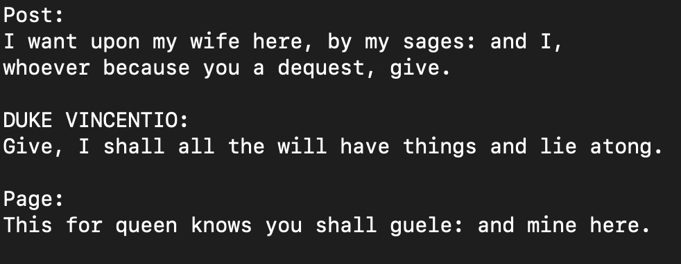

# shakespeareGPT

"Unleashing boundless Shakespearean prose with the power of a transformer-based language model, trained on the complete works of The Bard himself."

### Output from model_v0

Todo:
- [ ] make infinite
- [ ] web interface
    - Svelte frontend
    - Flask backend
- [ ] custom authors?
    - JK Rowling
    - Steven King
    - Leonardo DaVinci
- [ ] graph loss --> weights and biases?
    - https://wandb.ai
- [ ] OpenAI Text Embedding
    - https://openai.com/blog/new-and-improved-embedding-model
- [x] tqdm
- [x] gpt file
- [x] timeit for steps
